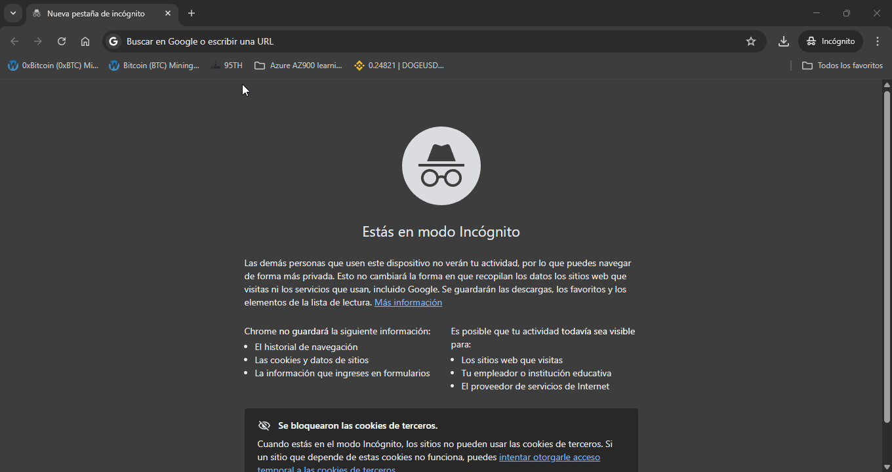

# AI Resume Analyzer

**AI Resume Analyzer** is a lightweight tool that helps evaluate how well a resume matches a job description.  
It provides a match score, skill coverage analysis, semantic similarity, and a Markdown report.  
The project includes a FastAPI backend for processing and a Streamlit frontend for interaction.

---

## 🖥️ Demo

Here’s a quick demo showing the app in action:



---


## Features

- Upload a CV and a Job Description (PDF, DOCX, or TXT)
- Extract and compare text content
- Calculate multiple scoring metrics:
  - Skill Coverage
  - Semantic Fit
  - Format & Completeness
  - Final Match Score (%)
- View analysis results interactively on a dashboard
- Export a professional Markdown report

## Tech Stack

- **Backend:** Python, FastAPI
- **Frontend:** Streamlit
- **Text Extraction:** PyMuPDF, python-docx
- **Vector Similarity:** scikit-learn, spaCy
- **Visualization:** Plotly, Streamlit

## Project Structure

```
AI-RESUME-ANALYZER/
├── api/                         # FastAPI backend
│   ├── __init__.py              # Package initializer
│   ├── extract.py               # File parsing logic for PDF, DOCX, TXT
│   ├── main.py                  # API endpoints and routing
│   ├── nlp_pipeline.py          # NLP preprocessing (tokenization, cleaning, normalization)
│   ├── report.py                # Generates Markdown report from analysis results
│   ├── scoring.py               # Computes match scores (semantic, skill, format, final)
│   └── skills.py                # Extracts and matches skill keywords from text
├── app/                         # Streamlit frontend
│   └── main_app.py              # User interface, file upload, visual feedback
├── data/                        # Sample files and job descriptions
│   └── samples/
│       ├── Example-cv.docx      # Example CV for testing
│       └── sample_jobdesc.txt   # Example job description
├── demo/                        # Project demo and visual assets
│   └── demo.gif                 # GIF showcasing the app's functionality
├── requirements.txt             # Python dependencies for API and frontend
└── README.md                    # Project overview, setup instructions, and demo link
```

## How to Run Locally

### 1. Clone the Repository

```bash
git clone https://github.com/your-username/ai-resume-analyzer.git
cd ai-resume-analyzer
```

### 2. Create and Activate Virtual Environment

```bash
python -m venv .venv
# On Windows
.venv\Scripts\activate
# On Unix or MacOS
source .venv/bin/activate
```

### 3. Install Dependencies

```bash
pip install -r requirements.txt
```

### 4. Run the Backend (FastAPI)

```bash
uvicorn api.main:app --reload
```

This will start the API at `http://127.0.0.1:8000`

### 5. Run the Frontend (Streamlit)

In a second terminal:

```bash
streamlit run app/main_app.py
```

Access the app at `http://localhost:8501`

## Example Output

After uploading a resume and job description, you’ll see:

- A match score out of 100%
- Sub-scores by category (skills, fit, format)
- Highlighted skill gaps and overlaps
- A downloadable Markdown report

---

**Disclaimer:** This tool is intended for educational and demonstration purposes only. Accuracy may vary depending on resume formats and job description quality.